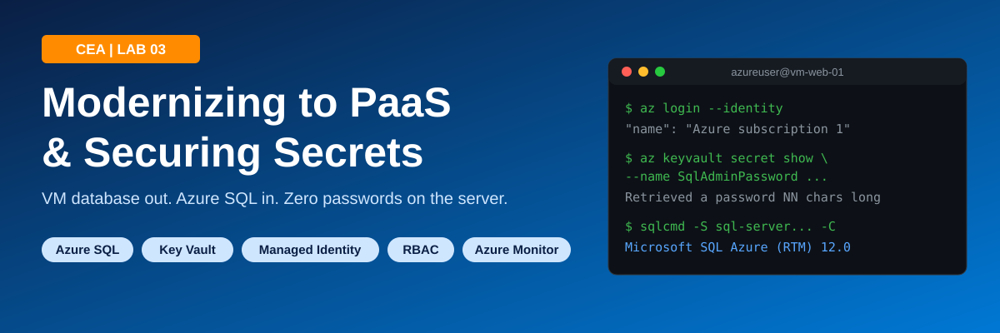
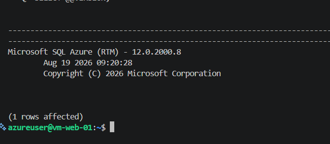
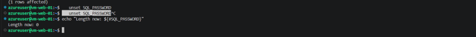
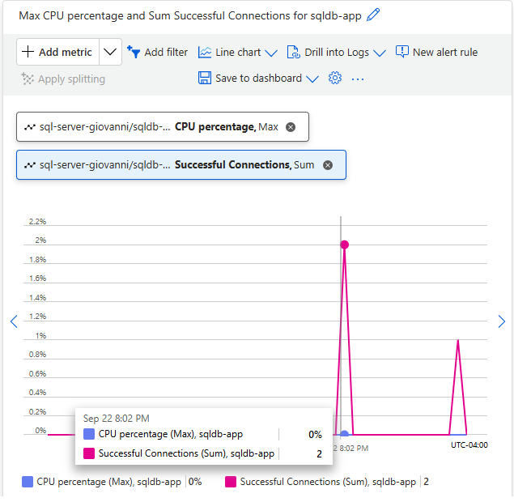
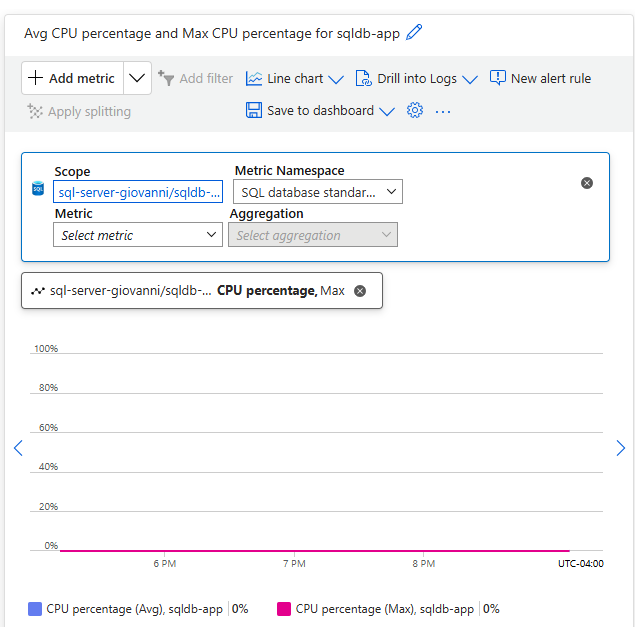
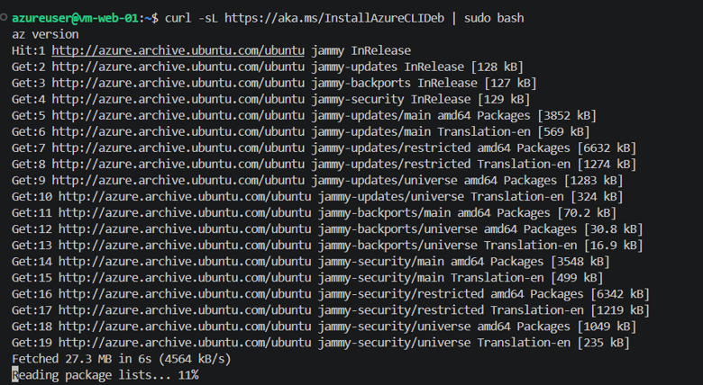

# Cloud Engineering Accelerator - Lab 03
# Modernizing to PaaS & Securing Secrets



**[Watch the 5-minute walkthrough on Loom](https://www.loom.com/share/f93414169d60403398382f7679b8b142)**

---

## What This Lab Is

This lab retires a self-managed database VM and replaces it with Azure SQL Database, a PaaS service where Microsoft handles patching, backups, and availability. The SQL admin password is stored in Azure Key Vault, and the web server gets a system-assigned managed identity with a read-only RBAC role. The result: the VM retrieves the password at runtime and connects to the database with no password in code, config files, or on disk. The lab ends with a live end-to-end test from the VM to prove the whole chain works.

## What You Will Build

```
 rg-lab02-giovanni (East US)                  rg-lab03-giovanni (West US 3)
+-----------------------------+              +-----------------------------------+
|                             |   (1) token  |                                   |
|  vm-web-01 (Ubuntu 22.04)   |------------->|  kv-lab03-giovanni (Key Vault)    |
|  System-assigned identity   |   (2) secret |  Secret: SqlAdminPassword         |
|  az login --identity        |<-------------|  RBAC: Key Vault Secrets User     |
|                             |              |                                   |
|                             |   (3) TDS    |                                   |
|                             |   1433/TLS   |  sql-server-giovanni              |
|                             |------------->|    +-- sqldb-app (Serverless)     |
|                             |              |  Public access: Selected networks |
|  vm-db-01  [DELETED]        |              |  Allow Azure services: On         |
+-----------------------------+              +-----------------------------------+
                                                         |
                                                         v
                                              Azure Monitor Metrics
                                              CPU % + Successful Connections
```

## Skills You Will Practice

| Skill | Tool |
|---|---|
| IaaS to PaaS migration and decommissioning | Azure Portal, Azure CLI |
| Managed relational database deployment | Azure SQL Database |
| SQL server firewall and public access control | Azure SQL Networking |
| Centralized secrets management | Azure Key Vault |
| Least-privilege access with RBAC | Key Vault Secrets User, Key Vault Administrator |
| Passwordless workload authentication | System-assigned managed identity |
| Remote Linux administration | VS Code Remote SSH |
| Database connectivity testing | sqlcmd (mssql-tools18) |
| Observability | Azure Monitor Metrics |

## Cost

Near $0 on the Azure SQL free offer (serverless, auto-pause) plus a few cents of Key Vault operations. Stop vm-web-01 when you finish.

## Time

60 to 75 minutes.

## Prerequisites

- Active Azure subscription
- Lab 02 completed, with vm-web-01 in rg-lab02-[yourname]
- VS Code with the Remote - SSH extension and the lab02-web host from Lab 02
- Azure CLI on your laptop (for the CLI path) and `az login` done
- PowerShell 7 recommended

## Quick Start

```powershell
. .\set-vars.ps1
```

```powershell
az group create --name $RG --location $LOCATION
```

```powershell
az keyvault create --name $KV_NAME --resource-group $RG --location $LOCATION --enable-rbac-authorization true
```

```powershell
az vm identity assign --resource-group $RG_WEB --name $VM_NAME
```

Then on vm-web-01 (Bash):

```bash
az login --identity
```

Full walkthrough, including SQL deployment and role assignments: [docs/CEA-Lab03-Modernizing-PaaS-Securing-Secrets-SOP.md](docs/CEA-Lab03-Modernizing-PaaS-Securing-Secrets-SOP.md)

## Security Flags Applied

| Flag / Setting | Why |
|---|---|
| `--enable-rbac-authorization true` | Key Vault uses Azure RBAC instead of legacy access policies. No one has access by default. |
| `Key Vault Secrets User` on the VM | Read secret values only. Cannot create, update, or delete. Least privilege. |
| `Key Vault Administrator` on your user | Only the human operator can manage vault contents. |
| System-assigned managed identity | No credential stored on the VM. Identity is deleted with the VM. |
| `--query value -o tsv` + `${#SQL_PASSWORD}` | Secret is loaded into memory and only its length is printed. Never echoed. |
| `unset SQL_PASSWORD` | Clears the secret from the shell session when done. |
| SQL public access: Selected networks | Only your client IP and Azure services can reach the server. |
| Minimum TLS 1.2 | Older TLS versions rejected. |
| Purge protection left off (lab only) | Allows full cleanup. Turn it on in production. |

## Verify It Works

On vm-web-01:

```bash
sqlcmd -S sql-server-giovanni.database.windows.net -d sqldb-app -U sqladmin -P "$SQL_PASSWORD" -C -Q "SELECT @@VERSION;"
```

Expected output:

```
Microsoft SQL Azure (RTM) - 12.0.2000.8
(1 rows affected)
```

## Screenshots

**Managed identity to Key Vault to Azure SQL: end-to-end query from vm-web-01**



**Secret cleared from the shell session after the test**



**Azure Monitor: Successful Connections spike from the portal login and the VM test**



**Azure Monitor: CPU percentage (serverless tier)**



**Installing the Azure CLI on vm-web-01**



## Project Structure

```
Azure-PaaS-Key-Vault-Secrets-Lab/
├── README.md                     This file
├── .gitignore                    Keeps keys, secrets, and state files out of Git
├── set-vars.ps1                  All lab variables in one place, prints them on load
├── assets/
│   ├── screenshots/              Proof screenshots from the completed build
│   │   ├── 01-vm-install-azure-cli.png
│   │   ├── 02-sqlcmd-end-to-end-success.png
│   │   ├── 03-secret-cleared-from-memory.png
│   │   ├── 04-monitor-cpu-percentage.png
│   │   └── 05-monitor-successful-connections.png
│   └── thumbnails/
│       ├── banner.svg            README hero image
│       ├── post1-loom.svg        LinkedIn post 1 thumbnail (video)
│       ├── post2-github.svg      LinkedIn post 2 thumbnail (repo)
│       ├── post3-learned.svg     LinkedIn post 3 thumbnail (lesson learned)
│       ├── post4-different.svg   LinkedIn post 4 thumbnail (what I'd change)
│       ├── png/                  1200px PNG copies of each thumbnail for LinkedIn uploads
│       └── generic/              Bold, low-text alternate thumbnails (SVG + png/)
├── linkedin/
│   └── CEA-Lab03-LinkedIn-Posts.md   All four LinkedIn posts with hashtags
└── docs/
    └── CEA-Lab03-Modernizing-PaaS-Securing-Secrets-SOP.md   Full step-by-step SOP
```

## Clean Up

```powershell
az group delete --name $RG --yes --no-wait
```

```powershell
az vm deallocate --resource-group $RG_WEB --name $VM_NAME
```

Keep rg-lab02-[yourname] if later labs build on vm-web-01. Key Vault is soft-deleted for 90 days after the resource group is removed.

## LinkedIn Post Series

| # | Post | Thumbnail | Generic alternate |
|---|---|---|---|
| 1 | [Loom walkthrough](https://www.loom.com/share/f93414169d60403398382f7679b8b142) | post1-loom.svg | generic/g1-watch.svg |
| 2 | [GitHub repo](linkedin/CEA-Lab03-LinkedIn-Posts.md#post-2---github-repo) | post2-github.svg | generic/g2-github.svg |
| 3 | [One thing I learned](linkedin/CEA-Lab03-LinkedIn-Posts.md#post-3---one-thing-i-learned) | post3-learned.svg | generic/g3-learned.svg |
| 4 | [What I'd do differently](linkedin/CEA-Lab03-LinkedIn-Posts.md#post-4---what-id-do-differently) | post4-different.svg | generic/g4-different.svg |

## Part of the CEA Series

| Lab | Topic | Repo |
|---|---|---|
| Lab 01 | Static Website on Azure Blob Storage | [Azure-Static-Website-Lab](https://github.com/Gguerra4networks/Azure-Static-Website-Lab) |
| Lab 02 | Secure 2-Tier Web App with Vulnerability Scanning | TBD |
| **Lab 03** | **Modernizing to PaaS & Securing Secrets** | **Azure-PaaS-Key-Vault-Secrets-Lab** |
| Lab 04 | Infrastructure as Code with Terraform | TBD |

## Author

**Giovanni Guerra**
Radio Network Infrastructure Specialist moving into Cloud Security | U.S. Army Veteran | Security+ | Network+

- GitHub: [github.com/Gguerra4networks](https://github.com/Gguerra4networks)
- LinkedIn: [linkedin.com/in/giovanni-giovanni](https://www.linkedin.com/in/giovanni-giovanni)
